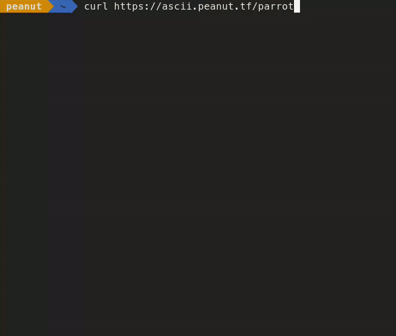

# cURL ASCII art

A project for creating colorful animated ASCII art frames from GIFs, and serving them over HTTP with cURL.
Forked from [`ascii.live`](https://github.com/hugomd/ascii-live).

Try it out in your terminal:
```bash
curl https://ascii.peanut.tf/parrot
```



## Running locally
To run the server locally on port `8080`, run:
```bash
cd ascii_curl
go run main.go
```

## Running in Docker
```bash
docker compose up --build -d
```

## Adding a new ASCII art
```bash
gen_frames.sh [-o output_dir] [-n name] [-d delay] [-c color_depth] [-w width] <gif_file>
```

### Options
- `-o <output_dir>`: Output directory. Default: `ascii_curl/ansi_frames/`
- `-n <name>`: Frame set name.
- `-d <delay>`: Frame delay in milliseconds. Default: `100`
- `-c <color_depth>`: Color depth. Must be `1` (monochrome), `8` (256 colors), or `24` (true color). Default: `8`
- `-w <width>`: Width of output. Default: `64`
